# Домашнее задание по теме "Система контроля версий Git"

### Техническое задание:

1.    Приложение «Сеть магазинов по продаже телефонов».
2.    Необходимо написать приложение по продаже телефонов в двух разных городах.
3.    Оба магазина продают одинаковые модели телефонов, но цены в магазинах городов немного отличаются.
4.    При покупке телефона, приложение сообщает, что куплен тот или иной телефон.
5.    Также есть счетчики количества проданных телефонов каждой модели.
6.    Это интернет – магазин, поэтому он будет приветствовать, предлагать право выбора города для покупки и выбор модели телефона для покупки.
7.    На ступени приветствия приложение будет предлагать выйти(закончить) работу, на ступени выбора телефона приложение будет предлагать показ статистику покупок в этом магазине (куплено телефонов такой – то модели – столько – то и т.д. Общая сумма покупок – такая -то).
8.    В одном из магазинов будет ремонтная мастерская, которая будет предлагать починку имеющегося у Вас сломанного телефона. Если да – телефон отремонтирован, если нет – не нуждаетесь в ремонте.
9.    Работа в приложении цикличная, т.е. после покупки, ремонта, оно снова Вам предложит выбор магазина, выбор телефона для покупки. Прекратить работу приложения можно на стартовой панели приветствия и выбора города.
10. По – возможности ремонт телефона предлагать не более одного раза при посещении магазина.
11. Данная работа предполагает использование абстрактных классов, интерфейсов, чтение с консоли, вывод на консоль, цикличность кода, применение условных и арифметических операторов.
12. Проект необходимо поместить на удаленный репозиторий GitHub, соответственно, создать там аккаунт. В процессе написания приложения работу в каждом классе, интерфейсе и по Вашему вкусу необходимо коммитить и отправлять данные на удаленный репозиторий.

13. Ссылку на готовое домашнее задание(GitHub) для проверки прислать преподавателю.

### Скриншоты домашнего задания

Скриншоты домашнего задания

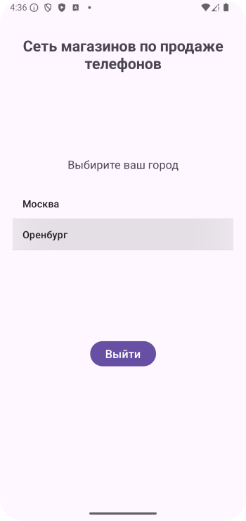

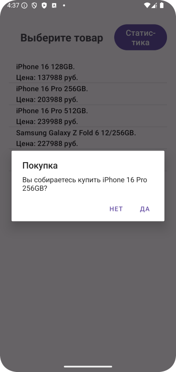

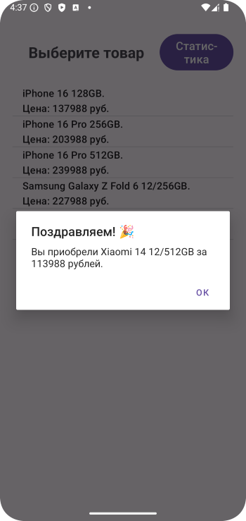
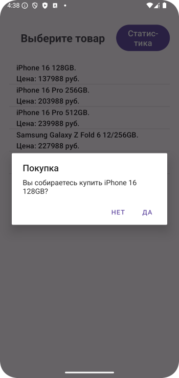
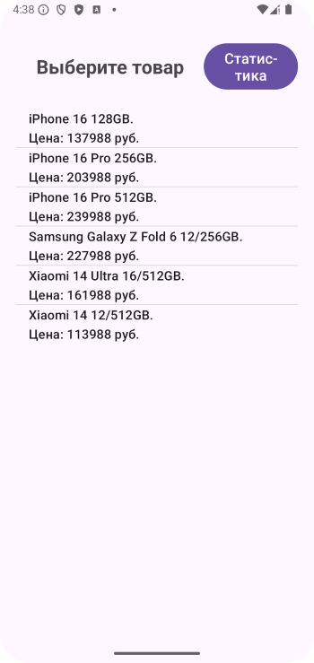
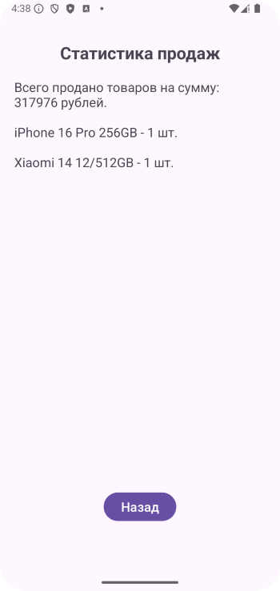

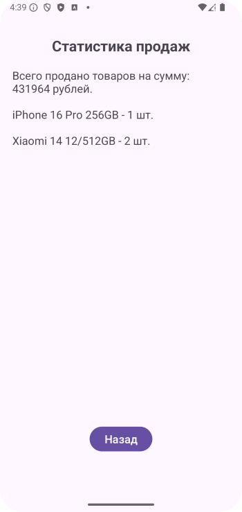
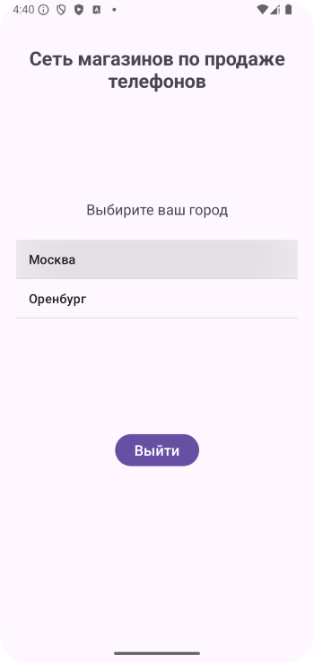
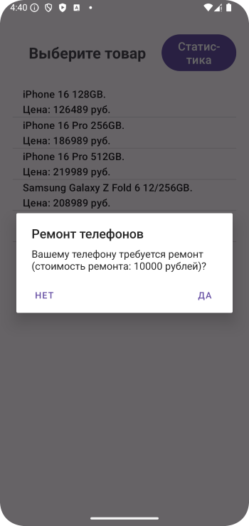
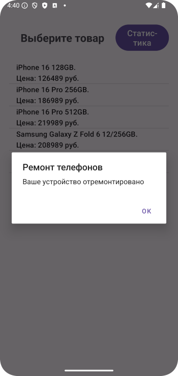

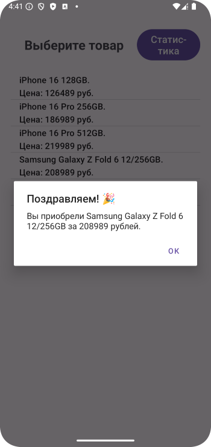
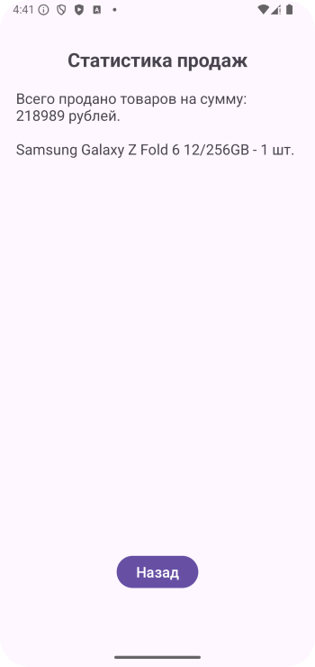

